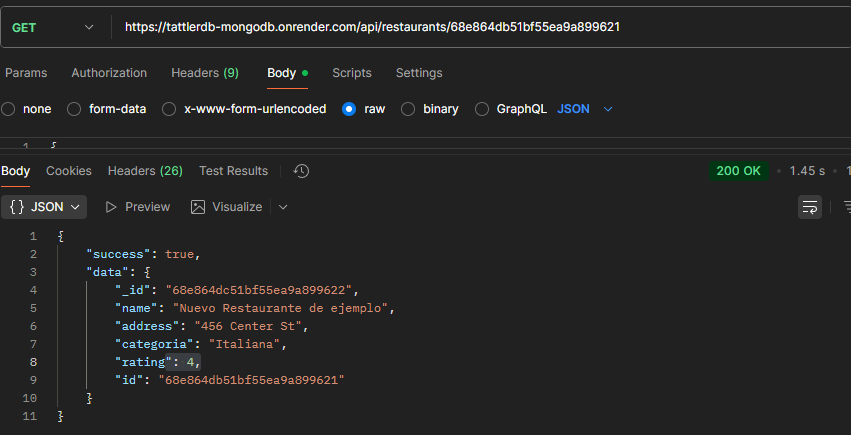
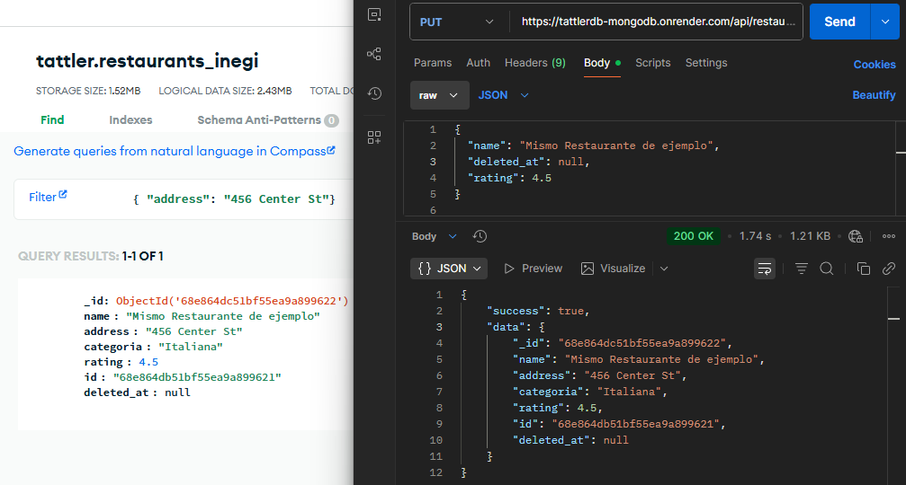
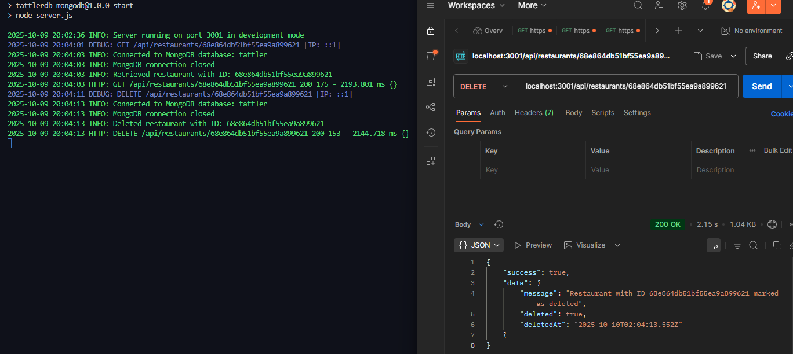

# TattlerDB API Documentation

This document provides detailed information about the TattlerDB API endpoints, request parameters, and response formats.

## Base URL

All API endpoints are relative to:

```
http://localhost:3001/api
```

or the host and port specified in your environment configuration.

## Authentication

Currently, the API does not require authentication. This will be implemented in future versions.

## Response Format

All API responses follow a consistent format:

```json
{
  "success": true|false,
  "data": { ... },  // Present when success is true
  "error": { ... }  // Present when success is false
}
```

## Error Handling

Error responses include:

```json
{
  "success": false,
  "error": {
    "message": "Error description",
    "stack": "Stack trace (in development mode only)"
  }
}
```

Common HTTP status codes:

- `200 OK`: Request successful
- `201 Created`: Resource created
- `400 Bad Request`: Invalid input
- `404 Not Found`: Resource not found
- `500 Internal Server Error`: Server error

## API Endpoints

### Health Endpoints

#### Check API Health

Retrieves the health status of the API including database connection.

```
GET /health
```

**Response**:

```json
{
  "success": true,
  "data": {
    "status": "healthy",
    "uptime": 123456,
    "timestamp": "2025-10-08T10:00:00Z",
    "database": {
      "status": "connected",
      "uptime": 12345,
      "version": "6.0.0"
    }
  }
}
```

#### Ping

Simple endpoint to check if API is responsive.

```
GET /health/ping
```

**Response**:

```json
{
  "success": true,
  "data": {
    "message": "pong",
    "timestamp": "2025-10-08T10:00:00Z"
  }
}
```

### Restaurant Endpoints

#### Get All Restaurants

Retrieves a paginated list of restaurants.

```
GET /restaurants
```

**Query Parameters**:

| Parameter | Type    | Default | Description                                        |
|-----------|---------|--------|----------------------------------------------------|
| page      | integer | 1      | Page number for pagination                         |
| limit     | integer | 20     | Number of results per page (max 100)               |

**Response**:

```json
{
  "success": true,
  "data": {
    "restaurants": [
      {
        "id": "1234",
        "name": "La Buena Mesa",
        "address": "123 Main St",
        "ubicacion": {
          "type": "Point",
          "coordinates": [-99.1332, 19.4326]
        },
        "categoria": "Mexicana",
        "rating": 4.5
      },
      // ...more restaurants
    ],
    "pagination": {
      "page": 1,
      "limit": 20,
      "totalPages": 10,
      "totalCount": 198
    }
  }
}
```

#### Get Restaurant by ID

Retrieves a single restaurant by its ID.

```
GET /restaurants/:id
```

**Path Parameters**:

| Parameter | Type   | Description                |
|-----------|--------|----------------------------|
| id        | string | Unique restaurant ID       |



**Response**:

```json
{
  "success": true,
  "data": {
    "id": "1234",
    "name": "La Buena Mesa",
    "address": "123 Main St",
    "ubicacion": {
      "type": "Point",
      "coordinates": [-99.1332, 19.4326]
    },
    "categoria": "Mexicana",
    "rating": 4.5,
    "horario": {
      "lunes": "9:00-18:00",
      "martes": "9:00-18:00",
      // ...other days
    }
  }
}
```

#### Create Restaurant

Creates a new restaurant.

```
POST /restaurants
```

**Request Body**:

```json
{
  "name": "Nuevo Restaurante",
  "address": "456 Center St",
  "ubicacion": {
    "type": "Point",
    "coordinates": [-99.1567, 19.4123]
  },
  "categoria": "Italiana",
  "rating": 4.0
}
```

**Response**:

```json
{
  "success": true,
  "data": {
    "id": "5678",
    "name": "Nuevo Restaurante",
    // ...other fields
    "createdAt": "2025-10-08T10:00:00Z"
  }
}
```

#### Update Restaurant

Updates an existing restaurant.

```
PUT /restaurants/:id
```

**Path Parameters**:

| Parameter | Type   | Description                |
|-----------|--------|----------------------------|
| id        | string | Unique restaurant ID       |

**Request Body**:

```json
{
  "name": "Restaurante Actualizado",
  "rating": 4.8
}
```

**Response**:

```json
{
  "success": true,
  "data": {
    "id": "1234",
    "name": "Restaurante Actualizado",
    "rating": 4.8,
    // ...other fields (unchanged fields remain the same)
    "updatedAt": "2025-10-08T10:00:00Z"
  }
}
```

#### Delete Restaurant

Deletes a restaurant by ID.

```
DELETE /restaurants/:id
```

**Path Parameters**:

| Parameter | Type   | Description                |
|-----------|--------|----------------------------|
| id        | string | Unique restaurant ID       |

**Response**:

```json
{
  "success": true,
  "data": {
    "message": "Restaurant with ID 1234 successfully deleted",
    "deletedCount": 1
  }
}
```

#### Search by Location

Finds restaurants near a specific location.

```
GET /restaurants/search/location
```

**Query Parameters**:

| Parameter  | Type    | Required | Description                                  |
|------------|---------|----------|----------------------------------------------|
| longitude  | number  | Yes      | Longitude coordinate                         |
| latitude   | number  | Yes      | Latitude coordinate                          |
| distance   | integer | No       | Search radius in meters (default: 1000)      |

**Response**:

```json
{
  "success": true,
  "data": {
    "count": 5,
    "restaurants": [
      {
        "id": "1234",
        "name": "La Buena Mesa",
        "distance": 450.2,
        // ...other restaurant fields
      },
      // ...more restaurants
    ]
  }
}
```

#### Text Search

Searches restaurants by text query across name, description, and other relevant fields.

```
GET /restaurants/search/text
```

**Query Parameters**:

| Parameter  | Type    | Required | Description                                  |
|------------|---------|----------|----------------------------------------------|
| q          | string  | Yes      | Search query                                 |

**Response**:

```json
{
  "success": true,
  "data": {
    "count": 3,
    "restaurants": [
      {
        "id": "1234",
        "name": "La Buena Mesa",
        "score": 0.95,
        // ...other restaurant fields
      },
      // ...more matching restaurants
    ]
  }
}
```

## Rate Limiting

The API currently does not implement rate limiting but may do so in future versions.

## Versioning

The API is currently at version 1.0. Future versions may include breaking changes and will be accessible via a versioned URL path.