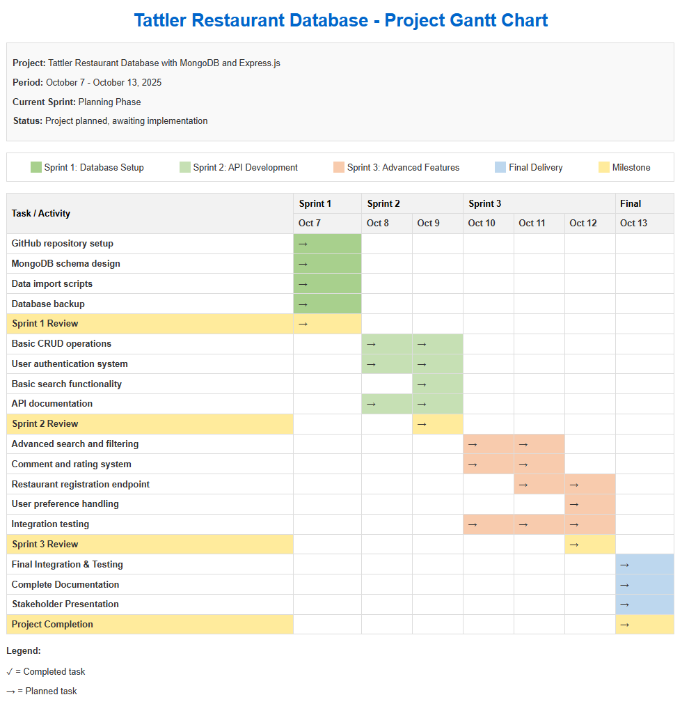

# Tattler Restaurant Database - Project Roadmap

## 1. Project Overview
This project aims to transform Tattler's restaurant directory into a dynamic, user-centered application using MongoDB to store restaurant data and Express.js to develop a RESTful API. The new platform will offer personalized experiences based on user preferences and up-to-date restaurant information.

## 2. Objectives

### 2.1 General Objective
To develop a MongoDB-based restaurant database and RESTful API that improves user engagement and provides personalized restaurant recommendations.

### 2.2 Specific Objectives
- Design and implement a MongoDB schema for restaurant data
- Create data import scripts from CSV to MongoDB
- Develop a REST API with Express.js for user interaction
- Implement user features including comments, ratings, and restaurant registration
- Create advanced search and filtering capabilities
- Ensure data remains up-to-date and relevant

## 3. Project Timeline

### Sprint 1: Database Setup (October 7, 2025)
**Milestones:**
- GitHub repository created and configured
- MongoDB schema designed
- Data import scripts developed
- Database backup completed

### Sprint 2: API Development (October 8-9, 2025)
**Milestones:**
- Basic CRUD operations implemented
- User authentication system developed
- Basic search functionality created

### Sprint 3: Advanced Features (October 10-12, 2025)
**Milestones:**
- Advanced search and filtering implemented
- Comment and rating system developed
- Restaurant registration endpoint created

### Final Delivery (October 13, 2025)
**Milestones:**
- All features tested and integrated
- Documentation completed
- Project presented to stakeholders

## 4. Deliverables by Sprint

### Sprint 1 Deliverables
- GitHub repository with README documentation
- MongoDB schema design documents
- CSV to MongoDB import scripts
- Database backup file

### Sprint 2 Deliverables
- Express.js API with basic CRUD endpoints
- User authentication module
- Search endpoint implementation
- API documentation

### Sprint 3 Deliverables
- Advanced search and filtering endpoints
- Comment and rating system
- Restaurant registration module
- User preference handling

### Final Delivery
- Complete codebase with all features integrated
- Comprehensive documentation
- Presentation materials for stakeholders

## 5. Stakeholders

| Stakeholder | Role | Responsibilities |
|-------------|------|------------------|
| Alejandra | Project Manager | Overall project oversight, stakeholder communication |
| Elian | Software Developer | Technical analysis, development support |
| Tattler Management | Client | Requirements approval, final acceptance |
| Restaurant Owners | End Users | Feedback on restaurant registration features |
| Customers | End Users | Feedback on search, filter, and rating features |

## 6. Risk Management

| Risk | Probability | Impact | Mitigation Strategy |
|------|------------|--------|---------------------|
| Data migration errors | Medium | High | Create verification scripts, perform incremental migrations with validation |
| API performance issues | Medium | High | Implement MongoDB indexing, caching, and pagination |
| User adoption challenges | Medium | High | Focus on intuitive UX and key features users need |
| Security vulnerabilities | Low | Critical | Implement proper authentication, input validation, and data sanitization |
| Timeline constraints | High | Medium | Prioritize core features, use agile methodology to adjust scope if needed |
| MongoDB scaling issues | Low | Medium | Design schema with scaling in mind, implement proper indexing |

## 7. Success Criteria
- Successful import of restaurant data into MongoDB
- REST API with all specified endpoints functioning correctly
- Ability for users to comment on and rate restaurants
- Restaurant owners can register and update information
- Advanced search and filtering capabilities working correctly

## 9. Communication Plan
- Daily updates on GitHub repository
- Sprint reviews at the end of each sprint
- Final presentation to stakeholders at project completion
- Documentation maintained throughout the development process